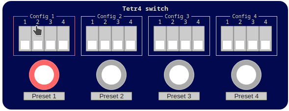

# Tetr4 Switch

LV2 audio plugin inspired on switches like Pedrone Penta Switch, Pedrone Yet, Carl Martin Octa Switch and others, but adaptable for the MOD Devices universe.
With it, is possible to define four presets of active CV and change between then. 



## TODO

### v1.0.0

* [x] Ttls
* [?] Source code
* [ ] Mod Gui
   * [x] Prototype
   * [ ] `html`
   * [ ] `stylesheet`
   * [ ] `js?`
* [ ] Publish

### v1.1.0

* [ ] Custom preset names - https://pedalboards.moddevices.com/plugins/aHR0cDovL29wZW4tbXVzaWMta29udHJvbGxlcnMuY2gvbHYyL25vdGVzI25vdGVz
* [ ] Custom HMI - https://github.com/moddevices/plugin-examples/tree/main/hmi-widgets-individual-tests
   * [ ] Led colour
   * [ ] Custom label
     * Atom sample 1: https://github.com/moddevices/mod-cv-plugins/blob/master/source/mod-cv-clock/mod-cv-clock.c
     * Atom sample 2: https://lv2plug.in/book/#_state_map_h

## Development

Requirements
```bash
sudo apt install lv2-dev
```

Compile
```bash
make build
```

Install
```bash
make install-user
# uninstalling
#make uninstall-user
```

Alternatively, compile on docker environment
```bash
docker build . -t builder
```

## Build

```bash
#docker run -ti --name mpb -p 9000:9000 -v $(pwd)/src:/tmp/local-mod-folder cbix/mod-plugin-builder:moddwarf
docker run --rm -ti --name mpb -p 9000:9000 -v $(pwd)/src:/home/builder/mod-plugin-builder/plugins/package/tetr4-switch cbix/mod-plugin-builder:moddwarf
sudo apt install iputils-ping --yes
./build moddwarf tetr4-switch
./build moddwarf tetr4-switch-publish

# Forçar o build sem ter que aumentar a versão em tetr4-switch.mk
rm -r /home/builder/mod-workdir/moddwarf/build/tetr4-switch-*

```


About 

* https://wiki.mod.audio/wiki/How_To_Build_and_Deploy_LV2_Plugin_to_MOD_Duo
* https://wiki.mod.audio/wiki/Preparing_the_Bundle
* https://wiki.mod.audio/wiki/Creating_the_GUI