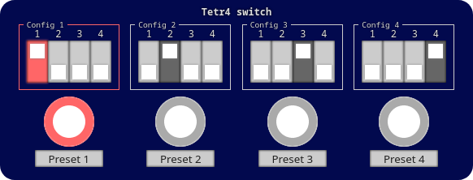
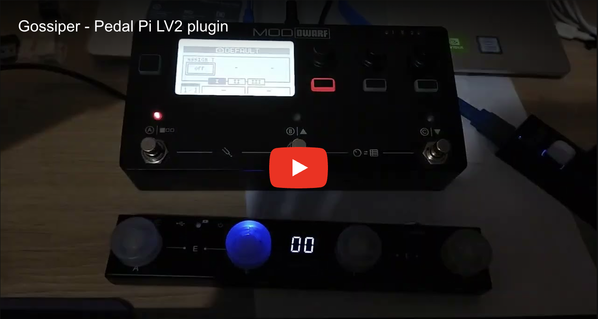
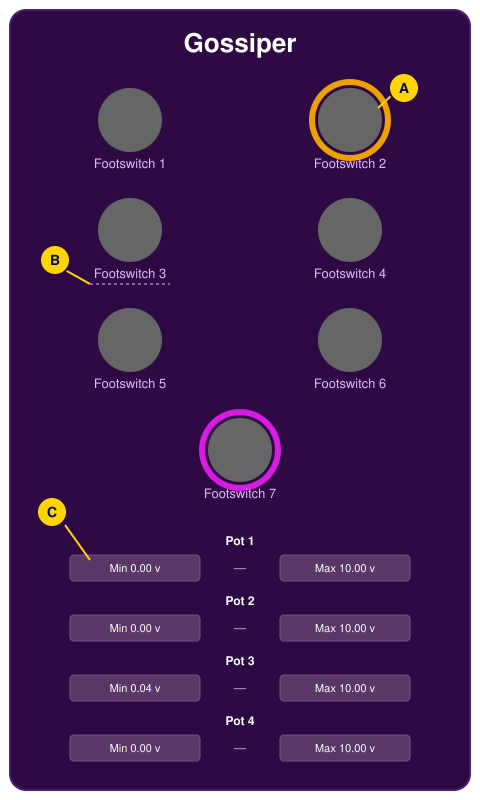
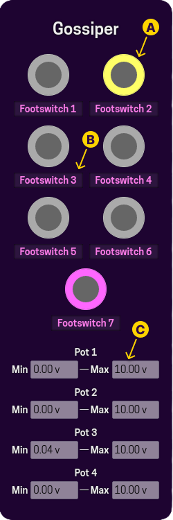
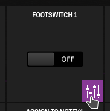
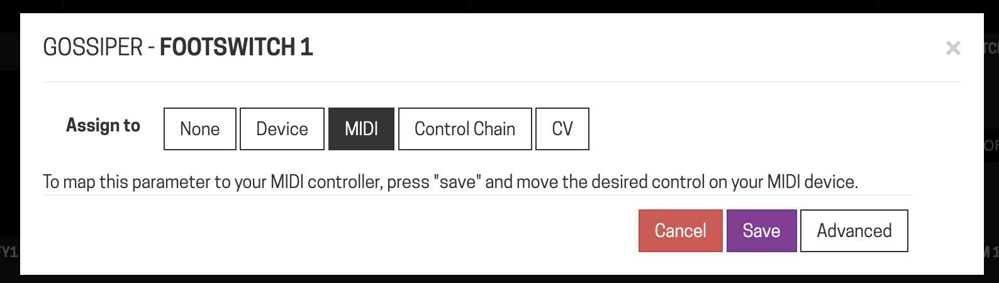
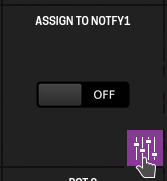
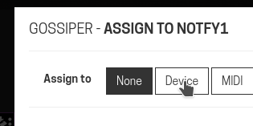
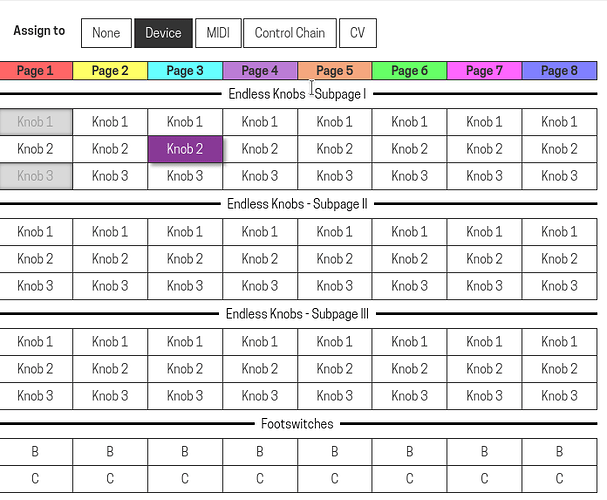
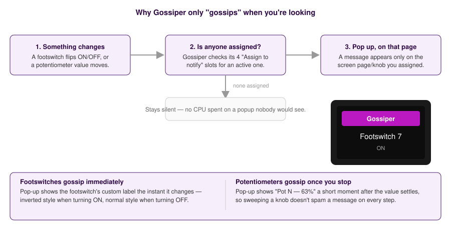

# Gossiper — User Manual 

Gossiper gives you screen and CV feedback for controls that don't have any
of their own — typically an external MIDI foot controller or knob box with
no LEDs or display.

Assign one of its parameters to receive the MIDI (or
CV, or device control), and Gossiper turns that into a plain CV signal
*and* a pop-up notification on the device screen.

It is an "educated gossiper": it only gossips about a
control if you're actually looking at it — a pop-up appears only on a
device screen page that has one of Gossiper's four "Assign to notify"
slots addressed to it. This is necessary because Mod devices only allow dialogs to be displayed if an `Assign to notify` parameter is linked to an endless knobs currently visible on the screen.

## 1. Plugin GUI overview

<!---->

| Item | Description | Interactivity | 
|---|---|---|
| **A — Footswitch indicator** | Lights up in its own colour while that footswitch is ON, and mirrors it on `CV Output N` (0 V/10 V). | Only visualization status. Clicking on it does nothing. |
| **B — Footswitch label** | Click and type a name (up to 15 characters) — this is the text a pop-up shows for that footswitch. | Editable field |
| **C — Potentiometer range** | The CV range (`Minimum`/`Maximum`, in volts) that potentiometer's 0–10 V output is scaled into. | Only visualization status. For changing its value, it is necessary to open the plugin's settings. |

## 2. What it's for

A MIDI foot controller (say, a cheap "Chocolate"-style box) can send Program
Change or CC messages, but usually has no LED to confirm whether a patch is
currently on or off, and no screen to show a knob's value. Gossiper closes
that loop:

1. **Assign** a `Footswitch N` or `Potentiometer N` parameter to receive
   that MIDI message (or a CV signal, or a device knob/footswitch).
2. **Assign** one of the 4 `Assign to notify N` parameters to a page/knob or
   footswitch slot on the device screen.
3. **Use the CV output.** `CV Foot - Out N` (footswitches) or
   `CV Pot - Out N` (potentiometers) now carries a plain, calibrated CV
   signal you can route into any other plugin's CV-addressable parameter —
   the same way you would with a "Control to CV" utility plugin.

From then on, every time that MIDI controller sends a message, you see it
confirmed on the device screen — without needing to look down at an
unlit external box.

## 3. Setting it up on the device

This is the actual assignment flow on a MOD Dwarf, screen by screen:

**Step 1 — Assign the control.** Open the plugin's settings by gear icon (⚙️).

Choose one of the `Footswitch <number>` parameters that is not used yet — 
or choose one of the `Pot <number>` (if you want to see a potentiometer status) —
and tap the assign icon next to it.

In the opened modal, select MIDI option in **Assign to**.

Now you must to send the
MIDI message (or pick the device control) you want to drive it. After it, save.

**Step 2 — Assign a notify slot.** Do the same for one of the
`Assign to notify <number>` parameters — this is what decides *where* the pop-up will show.

**Step 3 — Choose the target.** Pick what the notify slot is addressed to
— usually **Device**, so it lives on the screen itself.

**Step 4 — Pick the page and control.** Choose which page (and which knob
or footswitch, B/C) the notify slot sits on. Whenever that page is showing,
that's where the pop-up appears.

Repeat step 1 for as many footswitches/potentiometers as you're feeding in,
and step 2–4 for as many notify slots as you want pages covered by — up to
4, so you can get a pop-up whichever of up to 4 pages you're currently on.

## 4. How the pop-up decides when to appear

* **Footswitches gossip immediately** — the pop-up shows the footswitch's
  custom label the instant it flips, styled *inverted* when turning ON and
  *normal* when turning OFF.
* **Potentiometers gossip once you stop** — the pop-up shows `Pot N — xx%`
  a short moment after the value settles, so sweeping a knob doesn't spam a
  message on every intermediate step.
* **No assignment, no pop-up.** If none of the 4 notify slots is currently
  addressed to a visible page, Gossiper stays silent.

> **Requires MOD Dwarf firmware v1.13 or newer** for the pop-up mechanism.
> On older firmware the CV outputs still work; you just won't get the
> on-screen message.

> **Note from the author:** the pop-up is meant for occasional confirmation,
> not as a live debugging readout — don't expect to use it for something
> that changes every few milliseconds.

## 5. Renaming a footswitch

Click a footswitch's label field and type a new name (up to 15 characters).
Allowed characters are letters, digits, spaces and `+ - : _ .`; anything
else is replaced with `_`. The name is what the pop-up shows for that
footswitch, and it's saved with the pedalboard/preset.

## 6. Why bother: one real example

Gossiper can also be used to replaces stacks of "Control to CV" utility plugins —
one Gossiper with several footswitches/potentiometers assigned does the job
of many single-purpose CV converters, at a fraction of the CPU cost.

For instance, [Rom user once informed us that after its work replacing plugins to gossiper, the Dwarf's CPU usage was reduced from 81% down to 72%](https://forum.mod.audio/t/gossiper-plugin-to-say-what-is-happening-when-you-are-looking-it/9660/20?u=srmourasilva).

## 7. Port reference

| Port | Type | Description |
|---|---|---|
| `CV Foot - Out 1`–`7` | CV output | 0 V/10 V, mirrors `Footswitch N`. |
| `Footswitch 1`–`7` | Control input (toggle) | Assign this to receive MIDI/CV/device input. |
| `Assign to notify 1`–`4` | Control input | No audio/CV effect; assign to a device page/control so pop-ups show there. |
| `Pot 1`–`4` | Control input (0–1) | Assign this to receive MIDI/CV/device input. |
| `Minimum N` / `Maximum N` | Control input (volts) | The CV range `Potentiometer N`'s 0–1 value is scaled into. |
| `CV Pot - Out 1`–`4` | CV output | `Potentiometer N` scaled into `[Minimum N, Maximum N]` volts. |
| Footswitch label 1–7 | Plugin property (patch) | The custom name for each footswitch, edited from the GUI text field. |

## 8. Credits

Gossiper is developed by Paulo Mateus (SrMouraSilva). Discuss the plugin,
watch the demo video or follow its progress on the
[MOD Audio forum thread](https://forum.mod.audio/t/gossiper-plugin-to-say-what-is-happening-when-you-are-looking-it/9660)
or the [plugins-lv2 repository](https://github.com/SrMouraSilva/plugins-lv2).
